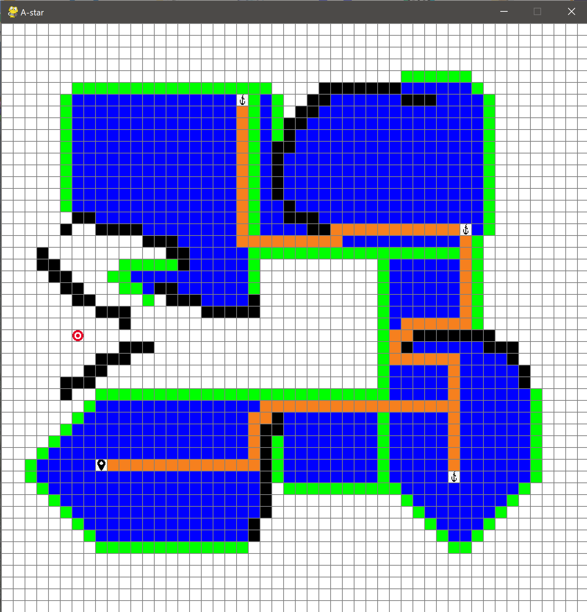

# Best-First-Search Visualizer

This best-first search visualizer was built with Pygame, a python library that is used here to process user input and visualize the searching process.
 
   
<div id="top"></div>


[](https://opensource.org/licenses/MIT)


<!-- TABLE OF CONTENTS -->
<details>
  <summary>Table of Contents</summary>
  <ol>
    <li>
      <a href="#about-the-project">About The Project</a>
      <ul>
        <li><a href="#built-with">Built With</a></li>
      </ul>
    </li>
    <li>
      <a href="#getting-started">Getting Started</a>
      <ul>
        <li><a href="#prerequisites">Prerequisites</a></li>
        <li><a href="#installation">Installation</a></li>
      </ul>
    </li>
    <li><a href="#license">License</a></li>
    <li><a href="#contact">Contact</a></li>
  </ol>
</details>


<!-- ABOUT THE PROJECT -->
## About The Project

This python-based search visualizer can be used to compare, analyze and visualize different best-first search algorithms.

It is possible to create own problems or mazes for the algorithm to traverse.

After the start point and endpoint were chosen, anchors can be set, which are subgoals for the algorithm to visit before the goal.

The chosen algorithm then tries to find a solution for the problem given and extracts its solution if a solution was found.

The extracted solution path may not be optimal, since optimality depends on the search algorithm.

<p align="right">(<a href="#top">back to top</a>)</p>

### Built With

* [Pygame](https://www.pygame.org/)

<p align="right">(<a href="#top">back to top</a>)</p>


<!-- GETTING STARTED -->
## Getting Started

To make use of this project, you need to have Python and Pygame installed.

If you have that already you can jump right over to the Installation section.

Otherwise, you can follow the Prerequisites to see how to install them.

### Prerequisites

For this project, you need to have Python installed. 
Just try to run the following command: 
```sh
 python --version
```
 If this runs successfully and we can get a python version, we are ready to go.
 Otherwise, refer to [https://www.python.org/](https://www.python.org/)
 
 The next step is to install Pygame.
 
 If you are unsure if you have installed Pygame already, you can run the following commands to test:
 ```sh
 python
 ```
 and then 
 ```sh
 import pygame
 ```
 If Pygame is installed you will receive a greeting in the command line, otherwise, just follow along.
 
 We will use PIP to install Pygame, a tool that is useful to install modules in Python.
 
 PIP comes with Python 3.4+, so we can use it right away.
 Run the following command to install Pygame. 
 ```sh 
 pip install pygame
 ```
 Now you are ready to go.
 

### Installation

1. Clone the repo
   ```sh
   git clone https://github.com/fabian-kruse/best-first-search
   ```
2. Run the following file in the "src" folder
   ```sh
   visualizer.py
   ```
3. Follow the instructions in the terminal
<p align="right">(<a href="#top">back to top</a>)</p>


<!-- USAGE EXAMPLES -->
## Usage

When starting the project you get a small introduction to how the tool works in the command line.

After that you are being asked how big the grid should be, then the tool should open after you entered a number.

In the tool, you can use the left and right keys to switch between different algorithms.

With your first click, you place the starting point and with the second you select the goal point.

Every further click places a wall block, which acts as a barrier for the algorithm.

If you select a field with the mouse wheel an anchor is set, that is, a subgoal for the algorithm to find before the final goal.

Clearing fields is possible by clicking on them with the right mouse button.

You start the search of the algorithm by pressing the space bar, the algorithm then tries to find a path to the goal.

During and after the search the fields are colored differently:

* white for unused fields
* black for barriers
* start, goal, and anchor points for their respective meaning
* blue for already considered fields
* green for currently considered fields
* orange for the solution path

After the algorithm terminated and either found a path to the goal or no solution at all, you can clear all information of the search algorithm, that is the blue, green, and orange fields by pressing "r" for reset.

You can then either run the same algorithm again or choose a different one for the same problem.

If you press "r" twice you clear all fields in the grid.

 
 <p align="center">
  
</p>
 
Enjoy!

<p align="right">(<a href="#top">back to top</a>)</p>


<!-- LICENSE -->
## License

Distributed under the MIT License. See `LICENSE.txt` for more information.

<p align="right">(<a href="#top">back to top</a>)</p>


<!-- CONTACT -->
## Contact

Fabian Kruse - fabian_kruse@gmx.de

Project Link: [https://github.com/fabian-kruse/best-first-search](https://github.com/fabian-kruse/best-first-search)

<p align="right">(<a href="#top">back to top</a>)</p>


© 2021 GitHub, Inc.
Terms
Privacy
Security
Status
Docs
Contact GitHub
Pricing
API
Training
Blog
About
